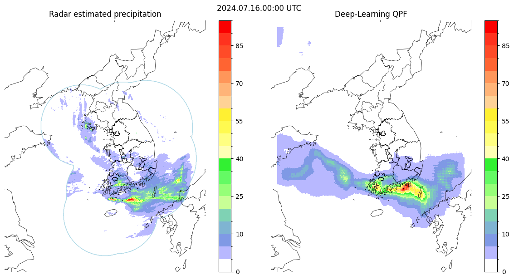

# Deep Learning based QPF (post-processing)

Training and validation dataset is at https://osf.io/ehwmv/files/osfstorage  

**Train DL-QPF model** (check paths for dataset):  
```
python train_gan.py --epoch ${epoch}
```

**Demo inference**:  
https://colab.research.google.com/github/hunter3789/Deep-Learning-QPF/blob/main/sample_inference.ipynb
  
**Sample result**:  

  
**Input file description**:  
[channels, height, width] = [80, 720, 576]  
Resolution: 2km x 2km  

Variables are as follows (altitude (topo) is not included in individual files) : 
| Number | Variable | Level (hPa) |
|--------|----------|-------------|
| 1      | U-component wind (U) | 1000 |
| 2      | U-component wind (U) | 950  |
| 3      | U-component wind (U) | 925  |
| 4      | U-component wind (U) | 900  |
| 5      | U-component wind (U) | 850  |
| 6      | U-component wind (U) | 800  |
| 7      | U-component wind (U) | 700  |
| 8      | U-component wind (U) | 600  |
| 9      | U-component wind (U) | 500  |
| 10     | U-component wind (U) | 400  |
| 11     | U-component wind (U) | 300  |
| 12     | U-component wind (U) | 250  |
| 13     | U-component wind (U) | 200  |
| 14     | U-component wind (U) | 150  |
| 15     | U-component wind (U) | 100  |
| 16     | V-component wind (V) | 1000 |
| 17     | V-component wind (V) | 950  |
| 18     | V-component wind (V) | 925  |
| 19     | V-component wind (V) | 900  |
| 20     | V-component wind (V) | 850  |
| 21     | V-component wind (V) | 800  |
| 22     | V-component wind (V) | 700  |
| 23     | V-component wind (V) | 600  |
| 24     | V-component wind (V) | 500  |
| 25     | V-component wind (V) | 400  |
| 26     | V-component wind (V) | 300  |
| 27     | V-component wind (V) | 250  |
| 28     | V-component wind (V) | 200  |
| 29     | V-component wind (V) | 150  |
| 30     | V-component wind (V) | 100  |
| 31     | Relative humidity (R)| 1000 |
| 32     | Relative humidity (R)| 950  |
| 33     | Relative humidity (R)| 925  |
| 34     | Relative humidity (R)| 900  |
| 35     | Relative humidity (R)| 850  |
| 36     | Relative humidity (R)| 800  |
| 37     | Relative humidity (R)| 700  |
| 38     | Relative humidity (R)| 600  |
| 39     | Relative humidity (R)| 500  |
| 40     | Relative humidity (R)| 400  |
| 41     | Relative humidity (R)| 300  |
| 42     | Relative humidity (R)| 250  |
| 43     | Relative humidity (R)| 200  |
| 44     | Relative humidity (R)| 150  |
| 45     | Relative humidity (R)| 100  |
| 46     | Temperature (T)      | 1000 |
| 47     | Temperature (T)      | 950  |
| 48     | Temperature (T)      | 925  |
| 49     | Temperature (T)      | 900  |
| 50     | Temperature (T)      | 850  |
| 51     | Temperature (T)      | 800  |
| 52     | Temperature (T)      | 700  |
| 53     | Temperature (T)      | 600  |
| 54     | Temperature (T)      | 500  |
| 55     | Temperature (T)      | 400  |
| 56     | Temperature (T)      | 300  |
| 57     | Temperature (T)      | 250  |
| 58     | Temperature (T)      | 200  |
| 59     | Temperature (T)      | 150  |
| 60     | Temperature (T)      | 100  |
| 61     | Geopotential Height (GH)| 1000 |
| 62     | Geopotential Height (GH)| 950  |
| 63     | Geopotential Height (GH)| 925  |
| 64     | Geopotential Height (GH)| 900  |
| 65     | Geopotential Height (GH)| 850  |
| 66     | Geopotential Height (GH)| 800  |
| 67     | Geopotential Height (GH)| 700  |
| 68     | Geopotential Height (GH)| 600  |
| 69     | Geopotential Height (GH)| 500  |
| 70     | Geopotential Height (GH)| 400  |
| 71     | Geopotential Height (GH)| 300  |
| 72     | Geopotential Height (GH)| 250  |
| 73     | Geopotential Height (GH)| 200  |
| 74     | Geopotential Height (GH)| 150  |
| 75     | Geopotential Height (GH)| 100  |
| 76     | 2m Temperature (2T)     | Surface |
| 77     | 2m Dew-point temperature (2D)      | Surface |
| 78     | Mean Sea Level pressure (MSL)      | Surface |
| 79     | Surface net Solar RaDiation (SSRD) | Surface |
| 80     | Altitude | Surface |
